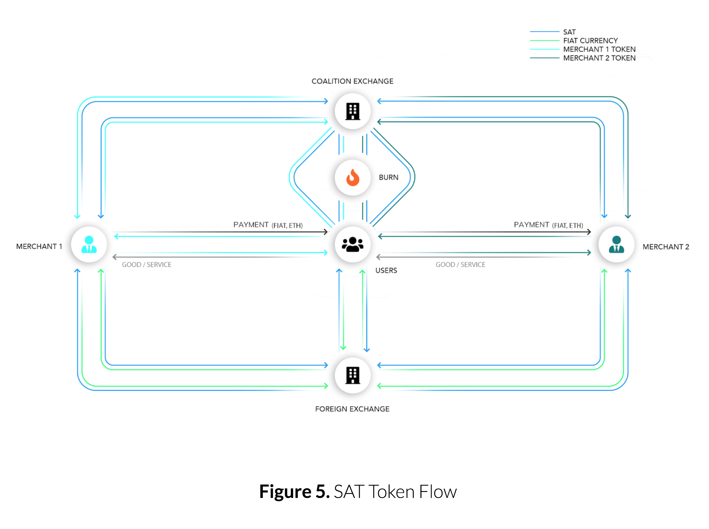

# Sandblock - Ethereum smart contracts

[](https://twitter.com/sandblock_io)

## Satisfaction Token



### Warning: This contracts has not been thoroughly audited, it will evolve and improve before launching.
 
The core protocol of the Sandblock project is named the Satisfaction Protocol, composed of subsections to handle the different aspects of the Customer Satisfaction related metrics. This protocol is decentralized and is based on Smart Contracts on the Ethereum blockchain. The Satisfaction Protocol handles the most important and sensitive aspects of the Sanblock project regarding the token economy, the rewards attributions and the various brand rules.
 
## Getting Started

We recommend using [Truffle](https://github.com/ConsenSys/truffle) and [Ganache](https://github.com/trufflesuite/ganache-cli) to test and deploy the Satisfaction Protocol


```sh
npm install -g truffle
npm install -g ganache-cli
```

### Installing

Install all the dependencies

```sh
npm install
```

## Running the tests

Tests on local machine

```sh
truffle test --network ganache
```

## Built With

* [Web3](https://github.com/ethereum/web3.js/) - Ethereum JavaScript API
* [Truffle](http://truffleframework.com) - Development framework for Ethereum
* [Ganache](https://github.com/trufflesuite/ganache-cli) - Fast Ethereum RPC client for testing and development
* [OpenZeppelin](https://github.com/OpenZeppelin/openzeppelin-solidity) - A framework to build secure smart contracts on Ethereum

## Contributing

Please read [CONTRIBUTING.md](CONTRIBUTING.md) for details on our code of conduct, and the process for submitting pull requests to us.


## Authors

* **Jeremy Grenier** - [jeremygrenier](https://github.com/jeremygrenier)

## License

This project is licensed under the MIT License - see the [LICENSE](LICENSE) file for details